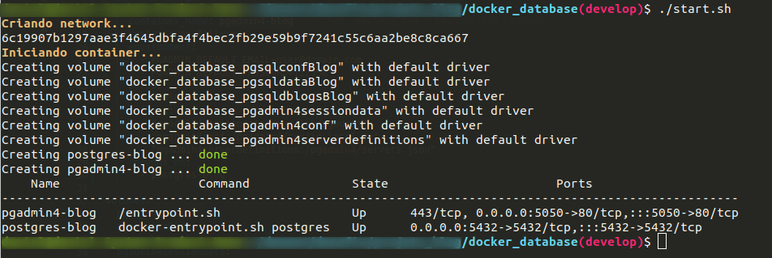
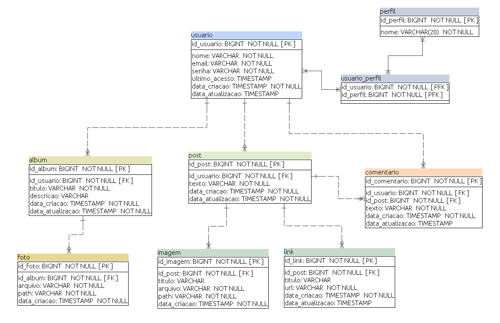
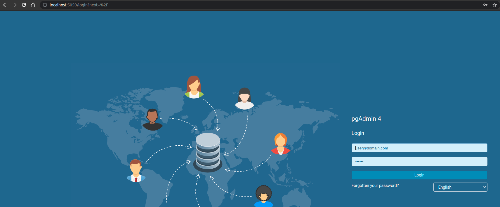
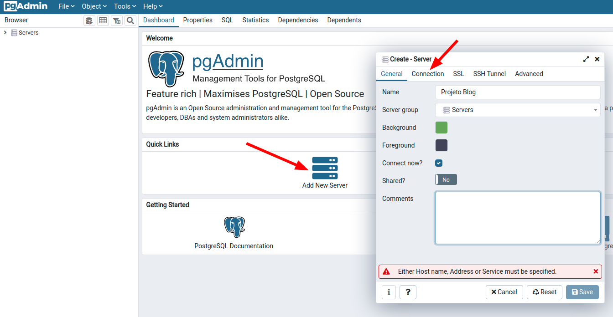
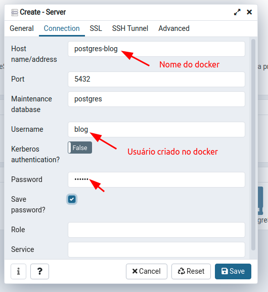
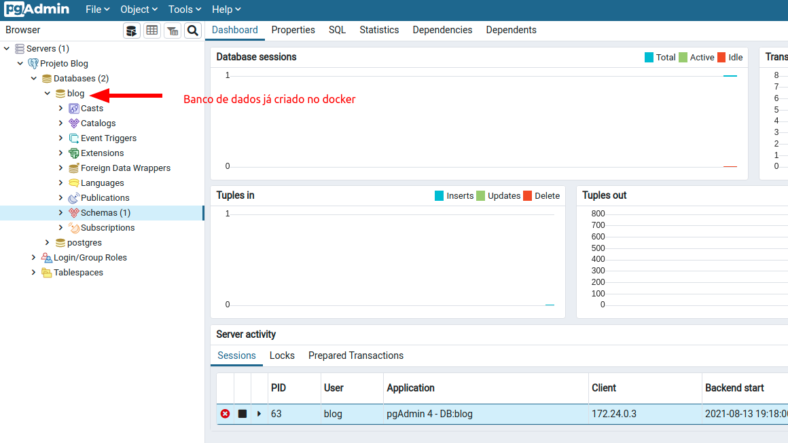

[](https://github.com/danielso2007/projetoblog/actions/workflows/main.yml)
[](https://codecov.io/gh/danielso2007/projetoblog)
[](https://sonarcloud.io/dashboard?id=danielso2007_projetoblog)

<!-- PROJECT SHIELDS -->
<!--
*** I'm using markdown "reference style" links for readability.
*** Reference links are enclosed in brackets [ ] instead of parentheses ( ).
*** See the bottom of this document for the declaration of the reference variables
*** for contributors-url, forks-url, etc. This is an optional, concise syntax you may use.
*** https://www.markdownguide.org/basic-syntax/#reference-style-links
-->
[![Contributors][contributors-shield]][contributors-url]
[![Forks][forks-shield]][forks-url]
[![Stargazers][stars-shield]][stars-url]
[![Issues][issues-shield]][issues-url]
[![MIT License][license-shield]][license-url]
[![LinkedIn][linkedin-shield]][linkedin-url]

# Projeto Blog API

Este projeto é usado para estudar projetos REST Spring Boot.

Este projeto usa o [Commons REST API](https://github.com/danielso2007/commons-rest-api) para dependência para as chamadas e padrões REST. Esse projeto foi feito por mim para abstrair todas a chamadas e retornos padrões do princípio RESTFull. Será necessário instalar o projeto localmente ou usar o [package do github](https://github.com/danielso2007/commons-rest-api/packages).

## Começando

Essas instruções fornecerão uma cópia do projeto instalado e funcionando em sua máquina local para fins de desenvolvimento e teste.

### Pré-requisitos

Utilizar o ambiente linux e ter o mavem e o java 11 para a compilação e execução do projeto. Para a utilização do banco de dados,s erá necessário instalar o Docker.

### Instalando

Recomendado instalar o [sdkman](https://sdkman.io/) que é uma ferramenta para gerenciar versões paralelas de vários kits de desenvolvimento de software na maioria dos sistemas baseados em Unix.

Com o sdkman, instale o java:
```
sdk list java
sdk install java 11.0.5.j9-adpt
```

Instalando o Maven:
```
sdk install maven
```

## Iniciando o banco de dados

O banco de dados utilziado é o postgres e poderá ser iniciado via docker. O projeto tem um docker-compose dentro da pasta `docker_database` e executar o seguinte comando:

`./start.sh`

<p align="center">
  
</p>


Será iniciado o docker com o banco de dados seguindo o modelo abaixo:

<p align="center">
  
</p>

Caso queira para e encerrar o container, execute os seguintes comandos:

* `stop.sh` para parar todos os containers
* `remove.sh` para encerrar o containers e remover do docker
* `remove_volumes.sh` para encerrar o containers e remover do docker com seus volumes

### Configurando o pgAdmin4

Ao iniciar o docker, também é iniciado o pgAdmin4. Para configurar o acesso ao banco de dados, acesse o endereço `http://localhost:5050/login?next=%2F` e seguir os passos:

* login: `user@domain.com`
* senha: `112358`

<p align="center">
  
</p>

Criar um novo acesso ao servidor.
<p align="center">
  
</p>

Criar a conexão com os dados abaixo:
* Host: `postgres-blog`
* Username: `blog`
* Password: `1q2w3e`
<p align="center">
  
</p>

O banco de dados já é criado no momento que o docker inicia.
<p align="center">
  
</p>

## Executando a API

Na pasta do projeto, executar o comando:

`mvn clean package spring-boot:run`

## Test

O projeto está configurado para não executar os testes quando construído para desenvolvimento. Para executar os testes, execute o comando abaixo:

`mvn clean test -Ptest`

Os testes são executados normalmente quando construído para **produção**. Há no arquivo do `pom.xml` essa configuração, que pode ser modificada a qualquer momento do desenvolvimento. Inicialmente, para o desenvolvimento, o desenvolvedor pode executar seus testes ao seguir o padrão TDD pela própria IDE.

### Code test coverage

É utilizado o [EclEmma Jacoco](https://www.eclemma.org/jacoco/) para verificação de cobertura de código. Para executar a cobertura:
```
mvn clean test verify -Ptest jacoco:report
```
Na pasta target, é gerado um "site" mostrando toda a cobertura de código. Este projeto utiliza o _Action_ para os testes e build da aplicação. Ao final do teste, é enviado para [codecov.io](https://codecov.io) todo o relatório. Para verificar a cobertura de teste deste código, acesse [codecov.io/gh/danielso2007]([codecov.io](https://app.codecov.io/gh/danielso2007/projetoblog)).

### Code quality

O sonar é usado para analisar a qualidade do código. Você pode acessar pelo link [sonarcloud.io/projetoblog](https://sonarcloud.io/dashboard?id=danielso2007_projetoblog).
Há um stage no Action do gitHub que executa o comando abaixo para fazer a análise e envia para o sonarcloud.io os dados:

`mvn -B verify org.sonarsource.scanner.maven:sonar-maven-plugin:sonar -Dsonar.projectKey=danielso2007_projetoblog`

### Documentação da API - swagger (OpenAPI 3)

A aplicação usa o swagger para a exibição da documentação da API. Para verificar, acesse os links [swagger-ui](http://localhost:8080/swagger-ui/index.html?configUrl=/api-docs/swagger-config#/) e [api-docs](http://localhost:8080/api-docs). Documentação [swagger.io](https://swagger.io/docs/open-source-tools/swagger-ui/usage/configuration/) e [springdoc.org](https://springdoc.org/).

Mais exemplos: [documenting-spring-boot-rest-api-springdoc-openapi-3](https://www.dariawan.com/tutorials/spring/documenting-spring-boot-rest-api-springdoc-openapi-3/)

Ou adicione o caminho abaixo:

`http://localhost:8080/swagger-ui/index.html?configUrl=/api-docs/swagger-config#/`

`http://localhost:8080/api-docs`

## Built With

* [Java](https://www.oracle.com/br/java/)
* [Spring Boot](https://spring.io/projects/spring-boot)
* [Maven](https://maven.apache.org/)
* [Undertow - Servidor Web](http://undertow.io/)
* [Swagger](https://swagger.io/)
* [Standard-version](https://github.com/conventional-changelog/standard-version)

## Contributing

Please read [CONTRIBUTING.md](CONTRIBUTING.md) for details on our code of conduct, and the process for submitting pull requests to us.

## Versioning

Usamos [SemVer](http://semver.org/) para versionar. Para as versões disponíveis, consulte as [tags neste repositório](https://github.com/danielso2007/virtualLibraryAPI/releases). 

## Authors

* **Daniel Oliveira** - *Initial work* - [danielso2007](https://github.com/danielso2007)

See also the list of [contributors](https://github.com/danielso2007/virtualLibraryAPI/graphs/contributors) who participated in this project.